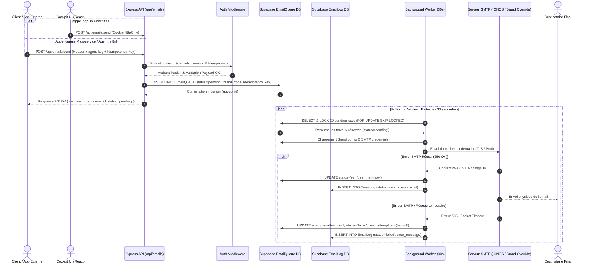

# Architecture Générale — Email Core Framework

Ce document présente l'architecture globale du **Email Core Framework** du Cockpit JS-Innov.IA, son intégration au sein de la plateforme Cockpit v3 et les flux de données de bout en bout.

---

## 🏛️ Vue d'Ensemble : Cockpit comme Hub Central

Le **Cockpit JS-Innov.IA** agit comme le Hub d'orchestration opérationnel et technique unifié pour l'ensemble des activités et filiales. Le service d'email est l'une des briques d'infrastructure centrales, au même titre que Stripe (Paiements), la Facturation, le réseau Peppol et les Agents IA.

```
                                  ┌──────────────────────────────────────────────────┐
                                  │               JS-INNOV.IA COCKPIT                │
                                  │            (Hub Central d'Orchestration)         │
                                  └────────────────────────┬─────────────────────────┘
                                                           │
        ┌───────────────────┬──────────────────────────────┼──────────────────────────────┬───────────────────┐
        │                   │                              │                              │                   │
        ▼                   ▼                              ▼                              ▼                   ▼
┌──────────────┐   ┌──────────────────┐       ┌────────────────────────┐      ┌─────────────────┐   ┌────────────────┐
│  Stripe /    │   │ Facturation Core │       │  EMAIL CORE FRAMEWORK  │      │ Network Peppol  │   │ Copilot OS /   │
│  Paiements   │   │  & Devis / PDF   │       │  (Multi-Brand Queue)   │      │ (Fact. Electron)│   │  Agents IA     │
└──────────────┘   └──────────────────┘       └────────────┬───────────┘      └─────────────────┘   └────────────────┘
                                                           │
                                                           ▼
                                      ┌────────────────────────────────────────┐
                                      │   Écosystème des 7 Marques (DB Config) │
                                      │  JS-Innov.IA | Assurances | Store      │
                                      │  VilleConnect | Tour de Dour | ...     │
                                      └────────────────────────────────────────┘
```

---

## 🔄 Diagramme de Flux de Bout en Bout (Sequence Diagram)

Ce diagramme détaille le cheminement complet d'une demande d'envoi d'email, depuis une application externe ou l'IHM Cockpit jusqu'à la réception du courriel par le destinataire final :



---

## 🧩 Composants Clés du Système

### 1. Layer Web / Routeur Express (`server-email.cjs`)
- Expose la façade REST standardisée.
- Intercepte, valide et assainit la structure des corps de requête JSON.
- Gère la déduplication en mémoire vive (cache LRU d'idempotence) couplée à la persistance PostgreSQL.

### 2. Base de Données Supabase PostgreSQL
- **`email_brands` :** Referentiel dynamique des 7 marques.
- **`email_templates` :** Bibliothèque des gabarits HTML.
- **`email_queue` :** File d'attente résiliente avec verrous transactionnels `FOR UPDATE SKIP LOCKED`.
- **`email_logs` :** Historique audit immuable.

### 3. Worker Asynchrone
- Processus autonome qui scrute la base de données à intervalles réguliers (30 secondes).
- Gère le cycle de vie des tâches, les reprises sur échec, le ré-essayage exponentiel et le nettoyage des tâches bloquées.

### 4. Moteur Transport Nodemailer
- Crée et gère des pools de connexions SMTP réutilisables vers IONOS ou vers les serveurs SMTP dédiés configurés dans `smtp_override`.
- Prend en charge la conversion MIME, l'encodage UTF-8, le support des pièces jointes et les signatures HTML.

---

## 🏬 Les 7 Marques Configurables via la Base de Données

Toutes les marques de l'écosystème partagent la même infrastructure d'envoi tout en conservant une étanchéité complète au niveau visuel et identitaire :

1. **JS-Innov.IA Core (`jsinnovia`) :** Notifications système, alertes d'administration et communications corporate holding.
2. **Assurances Dour (`assurances`) :** Attestations d'assurance, avis d'échéance et gestion des sinistres client.
3. **JS-Innov.IA Store (`store`) :** Confirmations de commande, factures d'achat et clés de licences logicielles.
4. **VilleConnect / Copilot OS (`villeconnect`) :** Communications citoyennes, alertes communales et synthèses administratives.
5. **Le Tour de Dour (`letourdedour`) :** Newsletters régionales, invitations événements et partenariats culturels.
6. **Synergie Dour (`synergiedour`) :** Mails du réseau des commerçants, invitations aux réunions d'affaires local.
7. **Miss & Mister Dour / Fashionist'ART (`fashionistart`) :** Confirmations d'inscriptions aux concours, billetterie et actualités mode/art.
