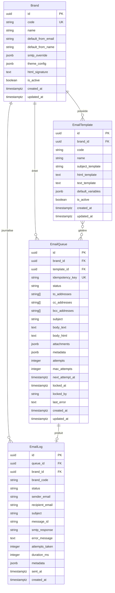

# Schéma de Base de Données — Email Core Framework

Ce document spécifie le schéma de base de données PostgreSQL / Supabase complet pour le service d'emails du Cockpit JS-Innov.IA.

---

## 📐 Diagramme Entity-Relationship (Mermaid ER)



---

## 🗄️ Description Détaillée des Tables

### 1. Table `public.email_brands` (Brand)
Stocke la configuration centralisée et dynamique des marques de l'écosystème JS-Innov.IA. Aucune marque n'est hardcodée dans le code Express.

| Colonne | Type | Contraintes | Description |
| :--- | :--- | :--- | :--- |
| `id` | `uuid` | `PRIMARY KEY DEFAULT gen_random_uuid()` | Identifiant unique de la marque |
| `code` | `text` | `NOT NULL UNIQUE` | Code court de la marque (ex: `jsinnovia`, `assurances`, `store`) |
| `name` | `text` | `NOT NULL` | Nom d'affichage lisible |
| `default_from_email` | `text` | `NOT NULL` | Adresse email d'expédition par défaut (RFC 5322) |
| `default_from_name` | `text` | `NOT NULL` | Nom de l'expéditeur affiché dans les boîtes de réception |
| `smtp_override` | `jsonb` | `DEFAULT NULL` | Surcharge facultative du serveur SMTP (host, port, auth, tls) |
| `theme_config` | `jsonb` | `NOT NULL DEFAULT '{}'` | Couleurs, logos, polices et habillage graphique HTML |
| `html_signature` | `text` | `DEFAULT NULL` | Signature HTML institutionnelle ajoutée au bas des emails |
| `is_active` | `boolean` | `NOT NULL DEFAULT true` | État d'activation de la marque |
| `created_at` | `timestamptz` | `NOT NULL DEFAULT now()` | Date de création |
| `updated_at` | `timestamptz` | `NOT NULL DEFAULT now()` | Date de dernière mise à jour |

---

### 2. Table `public.email_templates` (EmailTemplate)
Stocke les gabarits de messages HTML/Texte réutilisables par marque avec variables Handlebars/Mustache (`{{variable}}`).

| Colonne | Type | Contraintes | Description |
| :--- | :--- | :--- | :--- |
| `id` | `uuid` | `PRIMARY KEY DEFAULT gen_random_uuid()` | Identifiant unique du template |
| `brand_id` | `uuid` | `NOT NULL REFERENCES email_brands(id) ON DELETE CASCADE` | Marque propriétaire du template |
| `code` | `text` | `NOT NULL` | Code unique par marque (ex: `WELCOME_EMAIL`) |
| `name` | `text` | `NOT NULL` | Libellé descriptif pour le Cockpit UI |
| `subject_template` | `text` | `NOT NULL` | Template du sujet de l'email avec variables |
| `html_template` | `text` | `NOT NULL` | Corps HTML avec puces et variables |
| `text_template` | `text` | `DEFAULT NULL` | Alternative texte brut |
| `default_variables` | `jsonb` | `NOT NULL DEFAULT '{}'` | Valeurs par défaut des variables |
| `is_active` | `boolean` | `NOT NULL DEFAULT true` | Statut du template |
| `created_at` | `timestamptz` | `NOT NULL DEFAULT now()` | Date de création |
| `updated_at` | `timestamptz` | `NOT NULL DEFAULT now()` | Date de mise à jour |

*Contrainte d'unicité :* `UNIQUE(brand_id, code)`

---

### 3. Table `public.email_queue` (EmailQueue)
File d'attente persistante à forte résilience contenant les emails en attente, en cours d'envoi ou à réessayer.

| Colonne | Type | Contraintes | Description |
| :--- | :--- | :--- | :--- |
| `id` | `uuid` | `PRIMARY KEY DEFAULT gen_random_uuid()` | Identifiant unique du job en file d'attente |
| `brand_id` | `uuid` | `NOT NULL REFERENCES email_brands(id)` | Marque associante |
| `template_id` | `uuid` | `REFERENCES email_templates(id) ON DELETE SET NULL` | Template utilisé (optionnel) |
| `idempotency_key` | `text` | `UNIQUE` | Clé d'idempotence unique transmise par l'appelant |
| `status` | `text` | `NOT NULL DEFAULT 'pending' CHECK (status IN ('pending', 'sending', 'sent', 'failed', 'cancelled', 'dead_letter'))` | État dans la machine à états |
| `to_addresses` | `text[]` | `NOT NULL` | Liste des adresses destinataires |
| `cc_addresses` | `text[]` | `DEFAULT '{}'` | Adresses en copie conforme |
| `bcc_addresses` | `text[]` | `DEFAULT '{}'` | Adresses en copie cachée |
| `subject` | `text` | `NOT NULL` | Sujet final résolu |
| `body_text` | `text` | `DEFAULT NULL` | Corps texte brut |
| `body_html` | `text` | `DEFAULT NULL` | Corps HTML |
| `attachments` | `jsonb` | `DEFAULT '[]'` | Fichiers joints en base64 |
| `metadata` | `jsonb` | `DEFAULT '{}'` | Contextes métiers (order_id, user_id, etc.) |
| `attempts` | `integer` | `NOT NULL DEFAULT 0` | Compteur d'essais réalisés |
| `max_attempts` | `integer` | `NOT NULL DEFAULT 5` | Nombre maximal d'essais autorisés |
| `next_attempt_at` | `timestamptz` | `NOT NULL DEFAULT now()` | Heure prévue pour le prochain essai (backoff) |
| `locked_at` | `timestamptz` | `DEFAULT NULL` | Verrouillage anti-concurrence Worker |
| `locked_by` | `text` | `DEFAULT NULL` | Identifiant du noeud worker actif |
| `last_error` | `text` | `DEFAULT NULL` | Dernier message d'erreur SMTP/réseau |
| `created_at` | `timestamptz` | `NOT NULL DEFAULT now()` | Date d'insertion |
| `updated_at` | `timestamptz` | `NOT NULL DEFAULT now()` | Date de mise à jour |

---

### 4. Table `public.email_logs` (EmailLog)
Journal immuable de tous les événements d'envoi. Utilisé pour les audits, la recherche historique et les dashboards de statistiques.

| Colonne | Type | Contraintes | Description |
| :--- | :--- | :--- | :--- |
| `id` | `uuid` | `PRIMARY KEY DEFAULT gen_random_uuid()` | Identifiant unique du log |
| `queue_id` | `uuid` | `REFERENCES email_queue(id) ON DELETE SET NULL` | Référence au job en file d'attente |
| `brand_id` | `uuid` | `REFERENCES email_brands(id) ON DELETE SET NULL` | Marque |
| `brand_code` | `text` | `NOT NULL` | Code de la marque à la date d'envoi |
| `status` | `text` | `NOT NULL CHECK (status IN ('sent', 'failed', 'cancelled'))` | Résultat final de la tentative |
| `sender_email` | `text` | `NOT NULL` | Adresse d'expédition effective |
| `recipient_email` | `text` | `NOT NULL` | Adresse destinataire principale |
| `subject` | `text` | `NOT NULL` | Sujet de l'email |
| `message_id` | `text` | `DEFAULT NULL` | ID unique attribué par le serveur SMTP |
| `smtp_response` | `text` | `DEFAULT NULL` | Réponse brute du serveur SMTP (ex: `250 OK`) |
| `error_message` | `text` | `DEFAULT NULL` | Message d'échec en cas d'erreur |
| `attempts_taken` | `integer` | `NOT NULL DEFAULT 1` | Nombre total d'essais exécutés |
| `duration_ms` | `integer` | `DEFAULT NULL` | Durée d'envoi SMTP en millisecondes |
| `metadata` | `jsonb` | `DEFAULT '{}'` | Copie des métadonnées de requête |
| `sent_at` | `timestamptz` | `DEFAULT NULL` | Horodatage exact de confirmation SMTP |
| `created_at` | `timestamptz` | `NOT NULL DEFAULT now()` | Date de création de l'enregistrement |

---

## ⚡ Indexation

```sql
-- Index de performance pour le Worker Poller
CREATE INDEX IF NOT EXISTS idx_email_queue_worker 
ON public.email_queue (status, next_attempt_at) 
WHERE status IN ('pending', 'failed');

-- Index d'idempotence rapide
CREATE UNIQUE INDEX IF NOT EXISTS idx_email_queue_idempotency 
ON public.email_queue (idempotency_key) 
WHERE idempotency_key IS NOT NULL;

-- Index de recherche dans les logs par marque et date
CREATE INDEX IF NOT EXISTS idx_email_logs_brand_date 
ON public.email_logs (brand_code, created_at DESC);

-- Index de statut sur les logs
CREATE INDEX IF NOT EXISTS idx_email_logs_status 
ON public.email_logs (status);
```

---

## 🔒 Politiques de Sécurité Row Level Security (RLS)

Afin d'assurer une isolation stricte des données et d'empêcher les accès non autorisés :

```sql
-- Activation de RLS sur toutes les tables
ALTER TABLE public.email_brands ENABLE ROW LEVEL SECURITY;
ALTER TABLE public.email_templates ENABLE ROW LEVEL SECURITY;
ALTER TABLE public.email_queue ENABLE ROW LEVEL SECURITY;
ALTER TABLE public.email_logs ENABLE ROW LEVEL SECURITY;

-- 1. Politique Service Role (Express Backend / Worker) : Accès Total
CREATE POLICY service_role_all_brands ON public.email_brands FOR ALL USING (auth.role() = 'service_role');
CREATE POLICY service_role_all_templates ON public.email_templates FOR ALL USING (auth.role() = 'service_role');
CREATE POLICY service_role_all_queue ON public.email_queue FOR ALL USING (auth.role() = 'service_role');
CREATE POLICY service_role_all_logs ON public.email_logs FOR ALL USING (auth.role() = 'service_role');

-- 2. Politique Utilisateurs Cockpit (Read-Only pour la consultation)
CREATE POLICY user_read_brands ON public.email_brands FOR SELECT USING (auth.role() = 'authenticated');
CREATE POLICY user_read_templates ON public.email_templates FOR SELECT USING (auth.role() = 'authenticated');
CREATE POLICY user_read_logs ON public.email_logs FOR SELECT USING (auth.role() = 'authenticated');
```

---

## 🔄 Triggers Automatiques

Trigger de mise à jour automatique de la colonne `updated_at` :

```sql
CREATE OR REPLACE FUNCTION public.set_updated_at_column()
RETURNS TRIGGER LANGUAGE plpgsql AS $$
BEGIN
  NEW.updated_at = now();
  RETURN NEW;
END;
$$;

CREATE TRIGGER trg_email_brands_upd BEFORE UPDATE ON public.email_brands FOR EACH ROW EXECUTE FUNCTION public.set_updated_at_column();
CREATE TRIGGER trg_email_templates_upd BEFORE UPDATE ON public.email_templates FOR EACH ROW EXECUTE FUNCTION public.set_updated_at_column();
CREATE TRIGGER trg_email_queue_upd BEFORE UPDATE ON public.email_queue FOR EACH ROW EXECUTE FUNCTION public.set_updated_at_column();
```

---

## 🌱 Seed Data : Les 7 Marques de l'Écosystème JS-Innov.IA

Exécuter ce script SQL d'initialisation pour insérer la configuration d'origine des 7 marques :

```sql
INSERT INTO public.email_brands (code, name, default_from_email, default_from_name, theme_config, html_signature)
VALUES
(
  'jsinnovia',
  'JS-Innov.IA Core',
  'info@jsinnovia.com',
  'JS-Innov.IA Holding',
  '{"primary_color": "#D4AF37", "logo_url": "https://cockpit.jsinnovia.com/assets/logo-phoenix.png"}',
  '<p style="font-family:sans-serif; color:#D4AF37;"><strong>JS-Innov.IA Core</strong><br>Solutions d''Intelligence Artificielle de Nouvelle Génération</p>'
),
(
  'assurances',
  'Assurances Dour',
  'info@assurances-dour.be',
  'Assurances Dour Courtage',
  '{"primary_color": "#06B6D4", "logo_url": "https://assurances-dour.be/assets/logo.png"}',
  '<p style="font-family:sans-serif; color:#06B6D4;"><strong>Cabinet Assurances Dour</strong><br>Votre partenaire confiance en assurances & conseils</p>'
),
(
  'store',
  'JS-Innov.IA Store',
  'info@jsinnovia.store',
  'JS-Innov.IA Store',
  '{"primary_color": "#7C3AED", "logo_url": "https://jsinnovia.store/assets/logo.png"}',
  '<p style="font-family:sans-serif; color:#7C3AED;"><strong>JS-Innov.IA Store</strong><br>Boutique Officielle de Solutions & Licences IA</p>'
),
(
  'villeconnect',
  'VilleConnect / Copilot OS',
  'contact@villeconnect.be',
  'VilleConnect Smart City',
  '{"primary_color": "#10B981", "logo_url": "https://villeconnect.be/assets/logo.png"}',
  '<p style="font-family:sans-serif; color:#10B981;"><strong>VilleConnect Copilot OS</strong><br>La plateforme citoyenne intelligente pour communes de Belgique</p>'
),
(
  'letourdedour',
  'Le Tour de Dour',
  'contact@letourdedour.com',
  'Le Tour de Dour Média',
  '{"primary_color": "#F59E0B", "logo_url": "https://letourdedour.com/assets/logo.png"}',
  '<p style="font-family:sans-serif; color:#F59E0B;"><strong>Le Tour de Dour</strong><br>Actualités, culture et patrimoine de la région de Dour</p>'
),
(
  'synergiedour',
  'Synergie Dour',
  'contact@synergiedour.be',
  'Synergie Dour Business',
  '{"primary_color": "#3B82F6", "logo_url": "https://synergiedour.be/assets/logo.png"}',
  '<p style="font-family:sans-serif; color:#3B82F6;"><strong>Synergie Dour</strong><br>Réseau local d''entreprises, commerçants et indépendants</p>'
),
(
  'fashionistart',
  'Miss & Mister Dour / Fashionist''ART',
  'contact@missetmisterdour.be',
  'Fashionist''ART & Events',
  '{"primary_color": "#EC4899", "logo_url": "https://missetmisterdour.be/assets/logo.png"}',
  '<p style="font-family:sans-serif; color:#EC4899;"><strong>Fashionist''ART & Miss/Mister Dour</strong><br>Événements culturels, défilés & promotion artistique</p>'
)
ON CONFLICT (code) DO UPDATE 
SET default_from_email = EXCLUDED.default_from_email,
    default_from_name = EXCLUDED.default_from_name,
    theme_config = EXCLUDED.theme_config,
    html_signature = EXCLUDED.html_signature;
```
