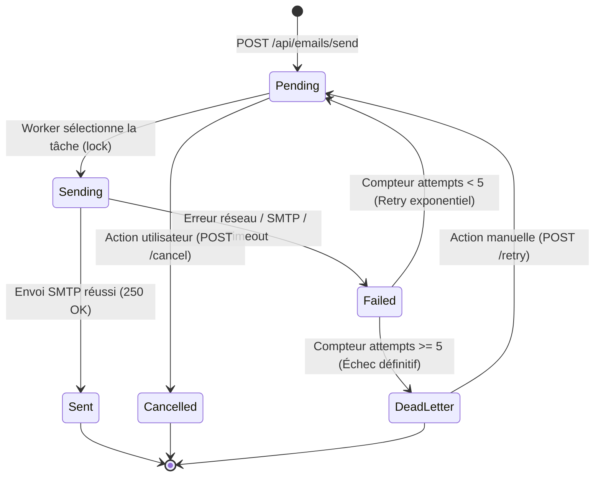

# Architecture & Moteur de File d'Attente (Email Queue)

Ce document décrit le fonctionnement interne de la file d'attente persistante (`EmailQueue`), du worker asynchrone, de la logique de retry exponentiel et des mécanismes de tolérance aux pannes.

---

## 🔄 Diagramme d'État des Emails (Mermaid State Diagram)

Chaque tâche d'email enregistrée dans la file d'attente suit une machine à états stricte :



---

## ⚙️ Spécifications du Worker d'Envoi

Le Worker est une tâche de fond (*background worker*) exécutée au sein du processus Express ou dans un microservice dédié.

- **Fréquence du Polling :** Toutes les **30 secondes**.
- **Taille de Batch (Lot) :** 20 emails maximum par cycle de polling.
- **Requête de réservation (*Select for Update / Lock*) :**
  Pour éviter qu'un même email soit envoyé en double par deux instances concurrentes de worker, le verrouillage utilise une mise à jour atomique :

```sql
UPDATE public.email_queue
SET status = 'sending',
    locked_at = now(),
    locked_by = 'worker-node-01',
    updated_at = now()
WHERE id IN (
  SELECT id FROM public.email_queue
  WHERE status IN ('pending', 'failed')
    AND next_attempt_at <= now()
    AND attempts < max_attempts
  ORDER BY next_attempt_at ASC
  LIMIT 20
  FOR UPDATE SKIP LOCKED
)
RETURNING *;
```

---

## 📈 Logique de Retry Exponentiel avec Backoff

Lorsqu'une tentative d'envoi échoue (ex: indisponibilité temporaire du serveur SMTP IONOS, erreur de socket réseau, rate limit SMTP), le système ne rejette pas l'email. Il incrémente le compteur `attempts` et calcule l'horodatage `next_attempt_at` selon l'algorithme de backoff exponentiel :

$$\text{Délai} = \text{Intervalle de base} \times 2^{(\text{attempts} - 1)}$$

### Échéancier officiel des retries (Max 5 essais)

| Tentative | Statut | Délai d'attente avant essai | Cumulative Time |
| :---: | :---: | :---: | :---: |
| **Essai 1** | Initial (`pending`) | **Immédiat** (0s) | 0 min |
| **Essai 2** | Retry 1 | **1 minute** | 1 min |
| **Essai 3** | Retry 2 | **5 minutes** | 6 min |
| **Essai 4** | Retry 3 | **30 minutes** | 36 min |
| **Essai 5** | Retry 4 | **2 heures** | 2h 36m |
| **Dernier essai** | Retry 5 | **8 heures** | 10h 36m |
| **Échec final** | `dead_letter` | Abandon automatique | Transféré en DLQ |

### Implémentation du calcul en JavaScript

```javascript
function calculateNextAttemptAt(attempts) {
  const delaysInMinutes = [1, 5, 30, 120, 480]; // 1m, 5m, 30m, 2h, 8h
  const delayMinutes = delaysInMinutes[Math.min(attempts - 1, delaysInMinutes.length - 1)] || 1;
  const nextDate = new Date();
  nextDate.setMinutes(nextDate.getMinutes() + delayMinutes);
  return nextDate;
}
```

---

## ☣️ Dead Letter Queue (DLQ)

Lorsque le compteur `attempts` atteint `max_attempts` (5 par défaut) sans succès :
1. Le statut passe automatiquement à `dead_letter`.
2. La raison de l'échec final est inscrite dans `last_error`.
3. Un enregistrement au statut `failed` est ajouté dans `EmailLog`.
4. Une alerte administrative est déclenchée si activée.

*Résolution manuelle :* Un opérateur Cockpit peut consulter les messages en Dead Letter Queue depuis l'interface web ou via l'API (`GET /api/emails/logs?status=failed`) et réamorcer l'envoi manuellement via `POST /api/emails/:id/retry`.

---

## 🛠️ Reprise Après Crash (*Restart Recovery*)

Si le serveur Node.js plante ou redémarre pendant qu'un email est au statut `sending`, la ligne pourrait rester bloquée indéfiniment.

Pour prévenir ce problème, le Worker exécute un job de nettoyage (*stuck rows recovery*) au démarrage et à chaque cycle de polling :

```sql
-- Déblocage des emails bloqués au statut 'sending' depuis plus de 5 minutes
UPDATE public.email_queue
SET status = 'pending',
    locked_at = NULL,
    locked_by = NULL,
    last_error = 'Worker timeout recovery: process crashed during sending'
WHERE status = 'sending'
  AND locked_at < now() - INTERVAL '5 minutes';
```

---

## 🔑 Garantie d'Idempotence (`Idempotency-Key`)

L'idempotence prévient l'envoi de courriels en double lors des réémissions réseau ou des doubles clics utilisateur.

1. **Règle d'unicité :** La colonne `idempotency_key` de la table `EmailQueue` possède une contrainte `UNIQUE`.
2. **Gestion des requêtes identiques :**
   - Si une deuxième requête arrive avec une `Idempotency-Key` identique :
     - Si le job existe déjà et est `pending` / `sent` : L'API répond directement `200 OK` avec les métadonnées du job existant.
     - Si le payload transmis différait : L'API retourne un code `409 Conflict`.
