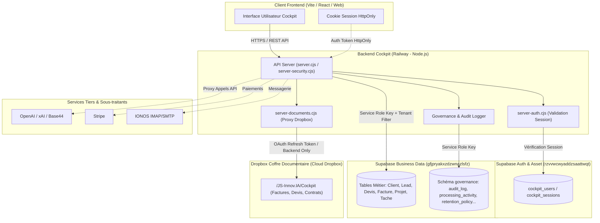

# Architecture de Gouvernance des Données — JS-Innov.IA Cockpit

**Projet :** JS-Innov.IA Cockpit
**Domaine :** `cockpit.jsinnovia.com` (Hébergé sur Railway)
**Version :** 1.0.0
**Date :** 13 août 2026
**Statut juridique :** **A VALIDER JURIDIQUEMENT** (Toutes les durées, bases légales et rôles sont soumis à revue juridique formelle).

---

## 1. Vue d'Ensemble & Source de Vérité Métier

Le Cockpit JS-Innov.IA est l'application centrale de gestion opérationnelle, administrative et financière de l'entreprise. Il centralise le pilotage des clients, leads, devis, factures, projets et tâches, ainsi que les fonctions avancées d'analyse des coûts IA et de gouvernance des données.

### Principes Fondamentaux d'Architecture
- **Source de Vérité Métier Unique :** Le Cockpit Backend (`cockpit.jsinnovia.com` sur Railway) est le coordinateur central. Aucune modification métier directe n'est autorisée depuis le client vers les bases de données sans passer par les validations backend.
- **Séparation des Responsabilités (SoD) :**
  - **Données Métier & Gouvernance :** Supabase projet `gfjpryakxzdzwnazlsfz` (Tables `Client`, `Lead`, `Devis`, `Facture`, `Projet`, `Tache`, et le schéma `governance`).
  - **Authentification & Sessions :** Supabase projet `rzvvwcwyaddzsaattwqt` (Tables `cockpit_users`, `cockpit_sessions`).
  - **Coffre Documentaire Sécurisé :** **Dropbox** (Stockage des fichiers physiques, factures PDF, devis, contrats). Aucun accès direct client n'est accordé à Dropbox : tout transit par le backend Cockpit.

---

## 2. Diagramme d'Architecture de Gouvernance



---

## 3. Modèle d'Habilitation et Rôles (RBAC)

Le système implémente un contrôle d'accès basé sur les rôles (RBAC - Role-Based Access Control) à 4 niveaux stricts :

| Rôle | Description & Périmètre d'Accès |
| :--- | :--- |
| **`superadmin`** | **Accès Total Système.** Configuration globale de la gouvernance, gestion des utilisateurs, consultation des logs d'audit complets, modification des règles de rétention et registres RGPD. |
| **`admin`** | **Gestion Opérationnelle Métier.** Consultation et modification de l'ensemble des données clients, projets, factures et devis de l'organisation. Accès aux rapports de coûts et statistiques. |
| **`collaborateur`** | **Exécution Métier Restreinte.** Création et édition des devis, suivi des projets et tâches. Accès limité aux clients et dossiers sur lesquels le collaborateur est explicitement assigné. |
| **`client`** | **Espace Client Extérieur.** Consultation exclusive en lecture de ses propres données (Devis, Factures, Projets) rattachées à son `organisation_id`. Aucun accès aux données internes ou aux registres de gouvernance. |

---

## 4. Isolation Multi-Tenant (Multi-Organisation)

Afin de garantir le cloisonnement étanche des données entre différentes entités ou organisations clientes :

1. **Colonne de Subpartitionnement :** La colonne `organisation_id` (valeur par défaut `'jsinnovia'`) est présente sur toutes les tables métier : `Client`, `Lead`, `Demande`, `Devis`, `Facture`, `Projet`, `Tache`, `Service`, `Commission`.
2. **Indexation Dédiée :** Des index B-Tree sont appliqués sur `organisation_id` pour chaque table (`idx_client_org`, `idx_devis_org`, `idx_facture_org`, etc.) garantissant des performances de filtrage optimales.
3. **Contrôle d'Isolation Backend :** Le backend Cockpit intercepte chaque requête utilisateur, extrait son `organisation_id` depuis la session validée, et injecte systématiquement la clause de filtrage `organisation_id = req.user.organisation_id`.

---

## 5. Row Level Security (RLS) et Sécurité Serveur

### Stratégie RLS sur Supabase
- **Schéma `governance` :** La sécurité au niveau des lignes (RLS) est active sur **toutes** les tables de gouvernance (`audit_log`, `data_classification`, `processing_activity`, `subprocessor_registry`, `consent_record`, `data_subject_request`, `retention_policy`).
- **Politique Unique `service_role` :** Seul le rôle `service_role` de Supabase a le droit d'effectuer des requêtes (SELECT, INSERT, UPDATE, DELETE) sur le schéma `governance`.
  ```sql
  CREATE POLICY "gov_audit_sr" ON governance.audit_log
  FOR ALL USING (auth.role() = 'service_role')
  WITH CHECK (auth.role() = 'service_role');
  ```
- **Validation Métier Serveur :** La clé `SUPABASE_SERVICE_ROLE_KEY` est strictement confinée au backend Cockpit (Railway). Le frontend ne communique jamais directement avec le schéma `governance` de Supabase.

---

## 6. Traçabilité et Journal d'Audit (`audit_log`)

Toute action critique, modification de donnée sensible, accès à un document confidentiel ou requête RGPD génère une entrée immuable dans `governance.audit_log`.

### Structure d'une Entrée d'Audit
- `actor_id` & `actor_email` : Identité de l'utilisateur à l'origine de l'action.
- `actor_role` : Rôle effectif au moment de l'action (`superadmin`, `admin`, etc.).
- `actor_ip_hash` : Empreinte SHA-256 anonymisée de l'adresse IP (Privacy by Design).
- `actor_ua` : User-Agent du navigateur / client.
- `action` : Code d'action normalisé (ex: `DOCUMENT_READ`, `LEAD_DELETE`, `RGPD_DSR_CREATE`).
- `entity_type` & `entity_id` : Cible de l'action (ex: `Facture`, `id_12345`).
- `tenant_id` : Identifiant de l'organisation concernée.
- `severity` : Niveau de sévérité (`info`, `warning`, `error`, `critical`).
- `metadata` : Objet JSONB contenant le contexte détaillé sans exposer de mot de passe ni token.

### Fonction de Logging
Une fonction SQL sécurisée `governance.log_action()` est disponible pour enregistrer les événements de manière standardisée.

---

## 7. Avertissement Légal

> **STATUT : A VALIDER JURIDIQUEMENT**
> L'ensemble de la présente architecture de gouvernance, des règles d'accès, des principes d'isolation et de logging constitue une mise en œuvre technique préparatoire. Elle doit impérativement faire l'objet d'une revue et d'une validation formelle par un juriste ou DPO (Délégué à la Protection des Données) qualifié avant mise en production définitive.
